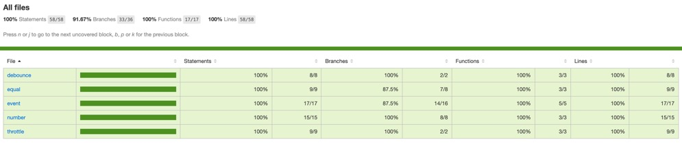

## mini-tools

人嘛，每个月总是会有一时冲动想手写一些函数的时候，所以不如，，，直接搞一款简易版 JavaScript 常用函数工具库。

项目采用 TypeScript + Rollup 开发完成，每个函数都有完善的单元测试，基本就这样。


## 使用方法

```sh
npm install mini-tools -S
```

```js
import { isEqual } from "mini-tools";
```

## 函数列表

- <a href="https://github.com/kyleezhang/mini-tools/blob/master/lib/equal/README.md">isEqual</a>
- <a href="https://github.com/kyleezhang/mini-tools/blob/master/lib/event/README.md">Events</a>
- <a href="https://github.com/kyleezhang/mini-tools/blob/master/lib/number/README.md">splitNumber</a>


## 测试覆盖率

